# VendorScoutAI — Final Architecture
### AI Agent Builder Series 2026 — Grand Finale (Problem Statement #7: Vendor Evaluation)

---

## Architecture diagram

```mermaid
flowchart TB
    subgraph Client["Client Layer"]
        UI["Streamlit UI<br/>python, streamlit<br/>dashboard + live trace + deal approval"]
    end

    subgraph Orch["Orchestration Layer (ADK)"]
        ORC["ADK Orchestrator<br/>google-adk-sequential-agent<br/>gemini-3.5-flash"]
    end

    subgraph Pipeline["Agentic Pipeline"]
        SRC["Sourcing Agent<br/>python, google-adk-search-tool<br/>ONLY tool on this agent"]
        VER["Verification Agent<br/>python, gemini-3.5-flash<br/>reasons over search results,<br/>no scraping"]
        NEG["Negotiation Agent<br/>python, gemini-3.5-flash<br/>drafts + sends WhatsApp msgs<br/>autonomous back-and-forth"]
    end

    subgraph Safety["Safety & Guardrails"]
        GATE["Deal-Lock Guardrail<br/>logic-gate<br/>Autonomous negotiation ALLOWED.<br/>Financial commitment BLOCKED<br/>without human approval."]
    end

    subgraph Ext["External Services"]
        GSEARCH["Google Search API<br/>web research"]
        META["Meta WhatsApp Cloud API<br/>vendor negotiation channel<br/>(test number for demo)"]
    end

    UI -->|start-sourcing request| ORC
    ORC -->|step 1: search| SRC
    SRC -->|vendor-list| ORC
    ORC -->|step 2: verify, then HALT| VER
    SRC -.->|web-search| GSEARCH
    VER -->|verified-vendors| ORC
    ORC -->|owner picks vendor -> step 3: negotiate| NEG
    NEG <-.->|real-time chat, EN/HI/KA| META
    NEG -->|proposed-deal| GATE
    GATE -->|approved-output only| UI
    UI -->|lock / reject decision| GATE
    GATE -.->|if locked: final-confirmation| NEG

    style Safety fill:#1a0f0f,stroke:#ff4444,stroke-width:2px
    style GATE fill:#2a1010,stroke:#ff4444,stroke-width:2px
```

---

## What changed across this design's iterations (for your own reference / judge Q&A)

| Version | Issue | Fix |
|---|---|---|
| v1 | `vendor-trust-db`, `session-state-cache` as separate infra | Removed — ADK in-process session state only, no external DB |
| v1 | `beautifulsoup4` scraping on Verification Agent | Removed — reasons over Sourcing Agent's search-grounded results instead |
| v1 | No guardrail visible in diagram | Added explicit Safety Guardrail layer |
| v2 | Guardrail blocked ALL outbound communication | Redesigned — blocks only deal *finalization*, not negotiation messaging |
| v3 | Negotiation was draft-only | Negotiation Agent now sends real WhatsApp messages and negotiates autonomously, discloses itself as AI, halts at deal-lock for human approval |
| v4 (final) | Twilio Sandbox required Content Templates on real senders; owner had no say in which vendor got contacted first | Switched to the Meta WhatsApp Cloud API; split the pipeline so Sourcing→Verification halts for the owner to pick a vendor before Negotiation runs; negotiation is now multilingual (English/Hindi/Kannada), always reporting back to the owner in English |

---

## Component summary

**Sourcing Agent** — `google_search` (ADK built-in tool, exclusively — no custom tools mixed in, per ADK's known tool-mixing compatibility constraint). Finds candidate vendors matching the requirement.

**Verification Agent** — custom function tools, Gemini reasoning over Sourcing's search-grounded output. Scores trust signals, flags red flags (suspiciously low price, no online footprint, generic listings). No web scraping.

**Negotiation Agent** — custom function tools + the Meta WhatsApp Cloud API. Opens a conversation with the owner-chosen vendor, **discloses itself as an AI assistant acting on the business owner's behalf** in its first message, asks the vendor's preferred language (English/Hindi/Kannada) and negotiates price/quantity/delivery autonomously in that language, falls back to the next-ranked vendor on its own if terms can't be met, and **stops at the point of finalizing terms** — never confirms, pays, or locks a deal without explicit human sign-off. Final terms are always reported back to the owner in English.

**Safety & Guardrails (cross-cutting layer)** — the single most important box in this diagram for judges. Enforces: autonomous negotiation messaging is permitted; financial commitment is not, until the business owner explicitly approves in the Streamlit UI.

**Demo scoping note (be upfront about this in your README/pitch):** vendor-side WhatsApp runs through the Meta WhatsApp Cloud API with a controlled test number (your own second number, or a consenting collaborator) — not real unknown vendors. Production-scale use requires Meta business verification, infeasible before the finale. State this honestly rather than implying production-scale WhatsApp integration.

---

## Tech stack

| Layer | Choice |
|---|---|
| Language | Python 3.11+ |
| Agent framework | Google ADK (`google-adk`, pin the version you install) |
| Orchestration | ADK `SequentialAgent` |
| LLM | Gemini 3.5 Flash |
| Web research | ADK built-in `google_search` tool |
| Messaging | Meta WhatsApp Cloud API (Graph API + Flask webhook for inbound) |
| UI | Streamlit |
| State | ADK in-process session state only — no external DB |
| Deployment | Cloud Run (Meta access token + Google Search API key as secrets) |
